# Millenco

Welcome to Millenco - This project is a website for Millennium Cooperative Society, a financial cooperative focused on empowering individuals through collective financial efforts. The website provides information about the cooperative, its services, and how individuals can join

## Table of Contents

1. [Introduction](#introduction)
2. [Features](#features)
3. [Getting Started](#getting-started)
    - [Installation](#installation)
    - [Available Scripts](#available-scripts)
4. [Usage](#usage)
    - [Website](#website)
    - [Homepage Background](#homepage-background)
    - [About](#about)
    - [Membership](#membership)
    - [Contact Us](#contact-us)
    - [Register](#register)
    - [Login](#login)
    - [Deposit](#deposit)
    - [Loan Application](#loan-application)
    - [Loan Repay](#loan-repay)
    - [Transaction Record](#transaction-record)
    - [Transaction Details](#transaction-details)
    - [User Profile](#user-profile)
5. [Tech Stack](#tech-stack)
6. [Contributing](#contributing)
7. [Troubleshooting](#troubleshooting)

## Introduction

Millenco is a website for Millennium Cooperative Society, a financial cooperative focused on empowering individuals through collective financial efforts. The website provides information about the cooperative, its services, and how individuals can join

## Features

- **Deposit:** Commit to a six-month deposit period to determine your eligible loan amount..
- **Loan Application:** Apply for loan after depositing for 6 month as a member.
- **Repay Loan:** Repay loan within a period of 6 month to have access to another loan.
- **User Authentication:** Utilizes Firebase authentication for a secure and personalized experience.

## Getting Started

### Installation

1. Clone the repository:

    git clone https://github.com/ZubairAlao/Millenco-coop.git
    cd /Millenco-coop

2. Install dependencies with Yarn
    yarn install

### Available Scripts

- `yarn dev`: Runs the app in development mode with Vite.
- `yarn build`: Builds the app for production.
- `yarn test`: Launches the test runner.

## Usage

### Website
[Visit Millenco Website](https://millenco.netlify.app/)

### Homepage Background
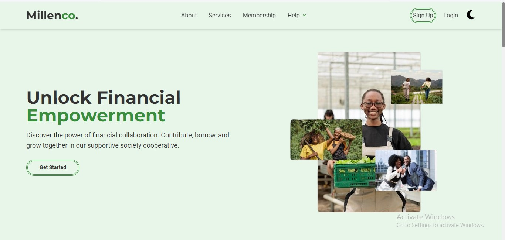

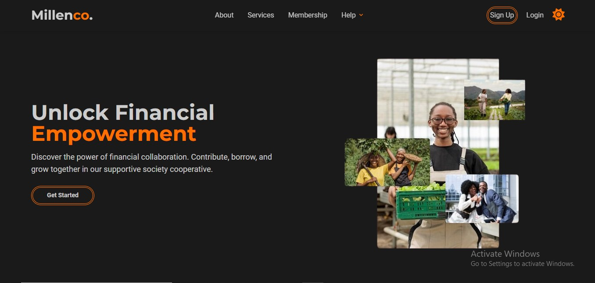

### About
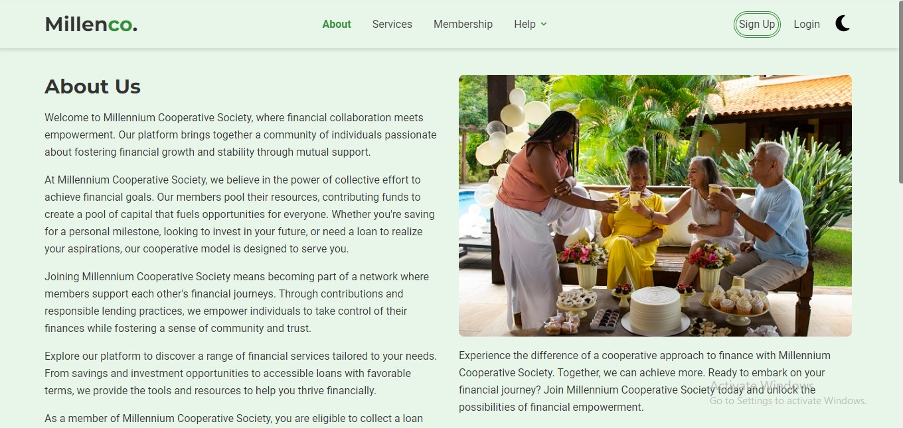

### Membership 
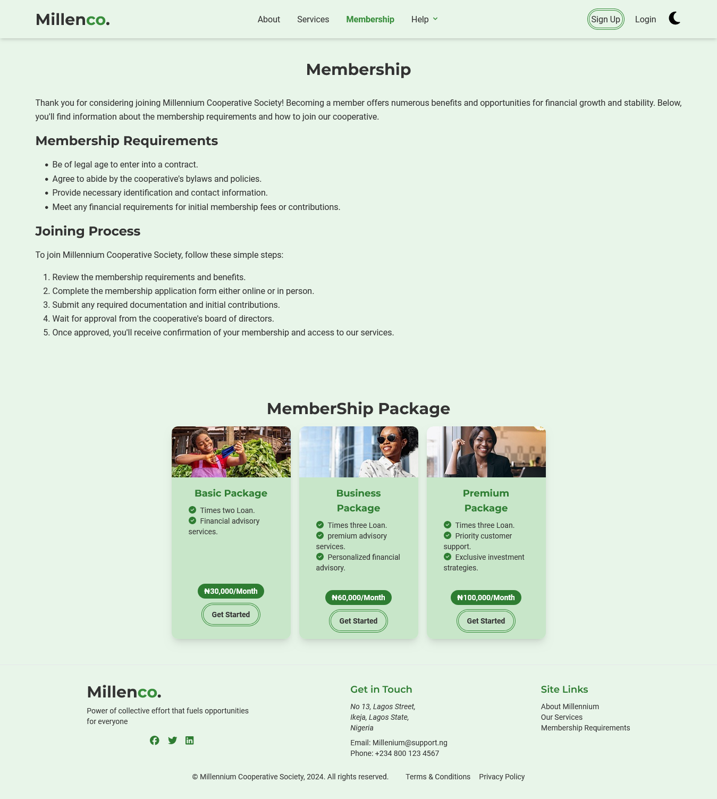

### Contact Us
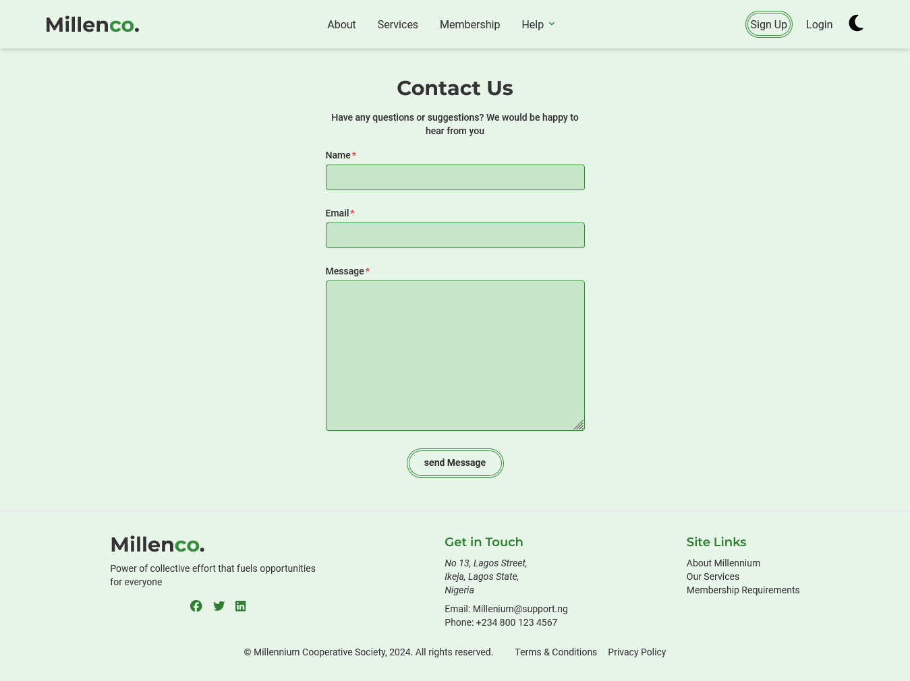

### Register 
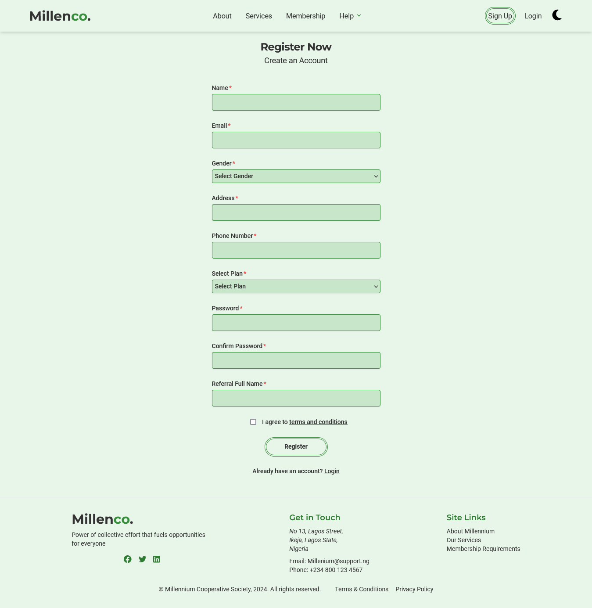

### Login 
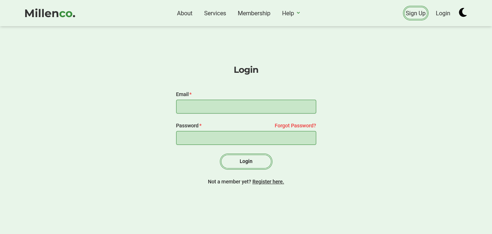

### Deposit 
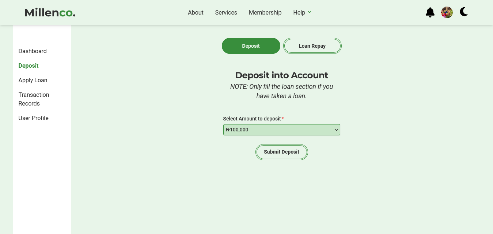

### Loan Application 
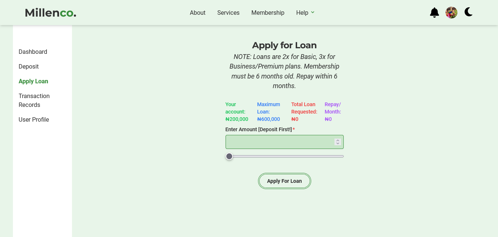

### Loan Repay 
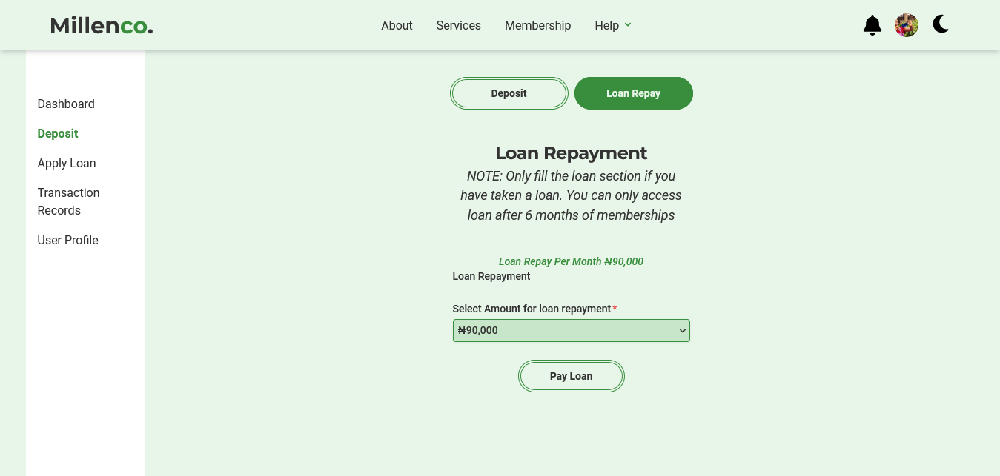

### Transaction Record 
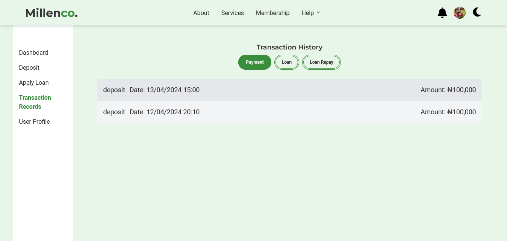

### Transaction Details 
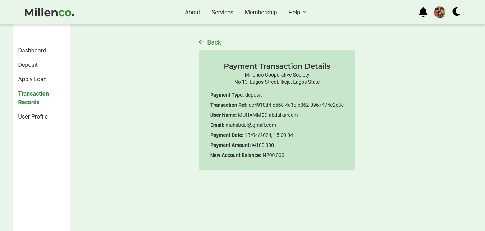

### User Profile 
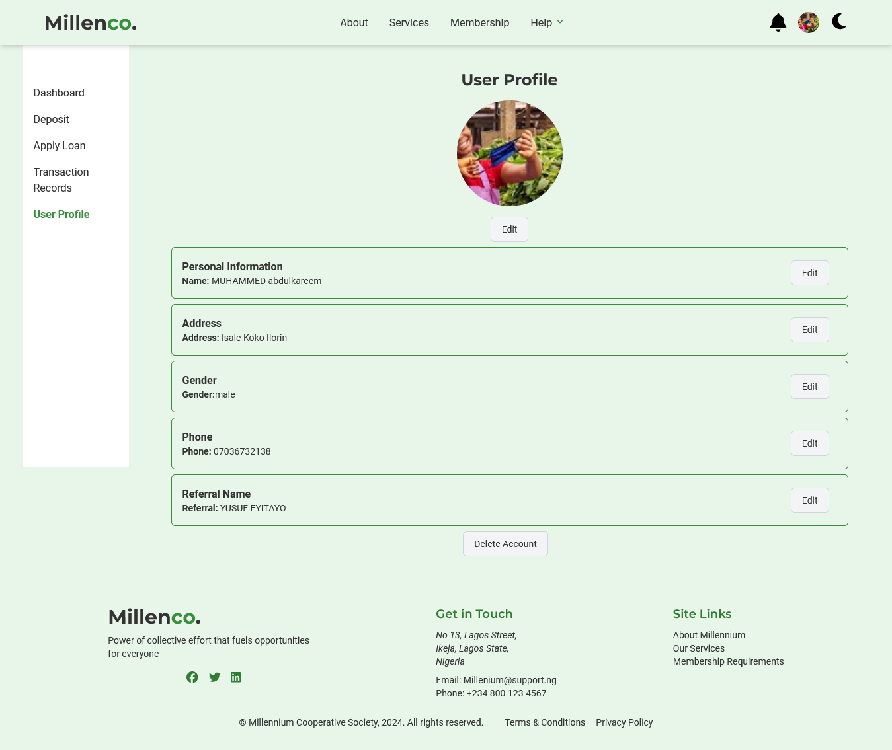

## Tech Stack

- **React:** JavaScript library for building user interfaces.
- **Tailwind CSS:** A utility-first CSS framework for rapidly building modern websites.
- **Firebase:** A comprehensive platform for building web and mobile applications, providing features like authentication, database, and storage.
- **Framer Motion:** A library for creating fluid animations and gestures in React applications.
- **React Query:** A powerful library for managing server state in React applications, providing tools for data fetching, caching, and synchronization.
- **Vite:** A fast frontend build tool that enhances the development experience.

## Contributing

We welcome contributions to Movie Maze! If you'd like to contribute, please follow these guidelines:

1. Fork the repository.
2. Create a new branch.
3. Make your changes and commit them.
4. Submit a pull request.

## Troubleshooting

If you encounter any issues with the installation or usage of Movie Maze, please check the following:

- Ensure that you have the latest version of Node.js and Yarn installed.
- Double-check your internet connection, especially when fetching data from external APIs.
- Refer to the project's [GitHub Issues](https://github.com/ZubairAlao/Millenco-coop/issues) for known problems or solutions.

